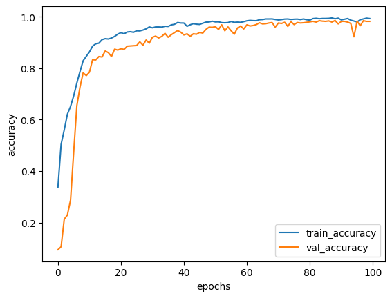

# 6.25日报

## speech-enhancement

1. 写脚本数据清洗，基于开源数据集进行降采样(减少gpu占用)，降低数据集大小；之后对语音信号归一化，防止语音叠加后溢出被截断；最后将noisy与clean数据集叠加为mixed数据，共100000条wav文件在训练集、1000条wav文件在测试集。
2. 模型训练，基于三层lstm+两层cnn+两层fc结构
3. 数据保存在eventtf中，可以用tensorboard查看
4. 训练至300个epoch左右，出现SDR骤降的情况，根据频谱mask图颜色变化过小猜测过拟合了。
5. 打算换criterion重新计算损失熵函数，MSE一是会增加计算复杂度，二是对结果的修正范围有限。

## 语音情感分析

1. 针对三个公开数据集进行数据预处理：TESS, RAVDESS, SAVEE，检验语音数据的波形图像与频谱图样，清洗掉频谱缺失与噪声干扰的wav文件
2. 搭建LSTM语音数据推理模型，并训练
3. 
4. 100个epoch后，情绪识别的准确率可以达到98.21
5. 
6. 因为数据集简单、规范、label类别较少，所以准确率较高
7. 具体结果可以查看Jupyter notebook，里面保存了结果

## 语音对齐

1. 互相关函数对齐，数学原理。将音频对齐转换为时延估计问题，比GCC-PHAT方式更加简单。
2. 
3. 在频域互相关中对广义互相关函数进行一个加权，PHAT起到了白化的作用使得互相关函数的峰值更加明显，如公式2所示。
4. 以无伴奏原唱作为输入基准，在时域上求延时tags，再将干声信号截断或补零，可得到以下峰值对照结果。

## 下一步

1. 寻找speech-enhancement模型过拟合的原因，从checkpoint30000的位置重新迁移学习，排除是否是偶然情况。按照论文结果，SDR可以达到10上下。
2. 对于speech-enhancement，换模型继续跑，生成多组对照。
3. 情绪分析可以使用其他的数据集，继续扩大模型，测试准确率。
