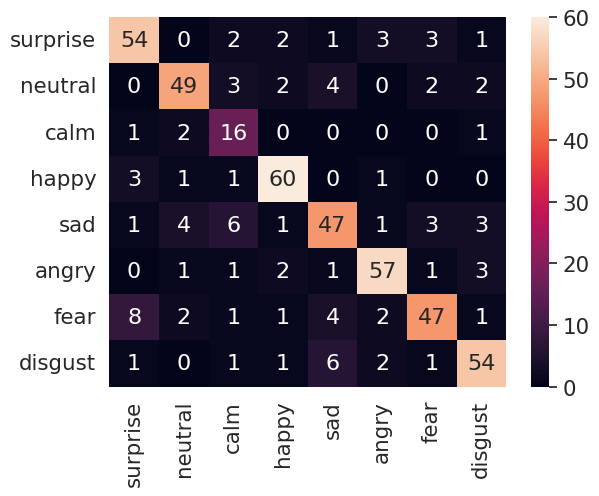

# 6.26日报

## speech-enhancement

1. 数据预处理问题：用100条语音数据进行测试数据清洗脚本，发现部分声音在rewrite过程中被截断；而且训练与测试集中label对应的语音名称不准确，导致模型无法准确定位target。
2. 重写脚本数据清洗，思路还是和之前类似，基于开源数据集进行降采样(减少gpu占用)，降低数据集大小；之后对语音信号归一化，防止语音叠加后溢出被截断；最后扩充数据集将noisy与clean数据集叠加为mixed数据，共100000条wav文件在训练集、1000条wav文件在测试集。
3. 不同点在于：将归一化计算替换为ffmpeg-normalize命令，在执行脚本之前需要执行`pip install ffmpeg-normalize`。并且加上`cpu_core_num`参数进行并行计算。
4. 模型训练，基于三层lstm+两层cnn+两层fc结构，模型的详细公式推导参考教学：[voicefilter tutorial](https://www.youtube.com/watch?v=gnRX2lzepz0)
5. 模型较为复杂
6. 数据保存在eventtf中，可以用tensorboard查看
7. 重新替换交叉熵函数crossentry，MSE一是会增加计算复杂度，二是对结果的修正范围有限。
8. 权值更新函数：源失真比SDR

    ```python

    def sdr(references, estimates):
        # compute SDR for one song
        delta = 1e-7  # avoid numerical errors
        num = np.sum(np.square(references), axis=(1, 2))
        den = np.sum(np.square(references - estimates), axis=(1, 2))
        num += delta
        den += delta
        return 10 * np.log10(num / den)
    ```

## 语音情感分析

1. 扩大数据集，语音清洗、语音增强。针对三个公开数据集进行数据预处理：TESS, RAVDESS, SAVEE，检验语音数据的波形图像与频谱图样，清洗掉频谱缺失与噪声干扰的wav文件，并对语音进行随机截断与补零。
2. 调用论文中的模型，分为origin版本与grad-reduction版本。
3. 100个epoch后，情绪识别的准确率达到70%。
4. 因为数据集更为随机与复杂、label类别增多，所以准确率降低的多。
5. 

## 下一步

1. 将voice-filter模型重跑一遍，从效果最好的checkpoint开始迁移学习。
2. 对于speech-enhancement，写一下inference的文件，都用wav格式保存。
3. 情绪分析部分继续复现论文的效果，即使论文中效果也有局限性，但是好在大大降低了计算的时间。
