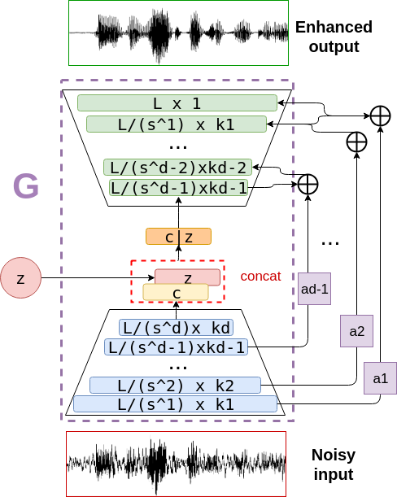

# 7.1日报

## speech-enhancement

1. 创建一个新的respository，里面包含语音增强的通用模型训练文件。框架分为：
    --dataset.py 划分数据集)\
    --trainer.py (包括tensorboard writer)\
    --model.py  (不同的模型仅需要更换model文件即可) \
    --utils.py (包含loss等评价指标)\
    --config.py (超参数设置)\
    --train.py (训练代码)\
    --test.py (模型测试)\
    --infer.py (模型推理)\
    --README.md (介绍)\
    --requirement.txt (库要求)
2. 难点在于dataset阶段，公开数据集都是分为clean与nosiy两部分，clean就是验证、测试集，noisy作为训练集需要对clean做一些处理，包括人声与噪声的线性叠加、采样率恢复、防止溢出、归一化等操作，写一段sh脚本文件可以批处理数据集文件
3. 现阶段用的数据集是VCTK+DEMAND，VCTK数据集包含纯净人声信号，DEMAND数据集包含生活场景中大部分的噪声，两个数据集采样率48kHz，位深16bit，适合音乐播放的场景需求
4. 现在主要对比三种模型的效果，seGAN、denoiser、DPCRN，具体效果保存在jupyter notebook中可以比较。
5. 模型大小区别很大，前两种增强效果非常明显，但是pth文件达到了150MB大小，完全不适合客户端场景，DPCRN模型大小只有10MB，但是耳听效果和前两种模型不相上下。

## 下一步

1. 改进一下通用代码，今天只跑了最简单的CNN+fc+sigmoid+loss_MSE，明天可以尝试一下其他loss，比如L1、L2、PESQ等效果。
2. 仔细测评DPCRN模型的效果，现在的测试音频长度不超过20s，如果是一段长音频不知道时效性能不能保证。
3. 对于效果更好的segan与denoiser模型，尝试量化一下其中的weight、bias，在DEMAND中看看效果。
4. 情绪分析从明天开始继续，可以使用CREME数据集(15GB)，继续扩大DNN模型，测试准确率。
