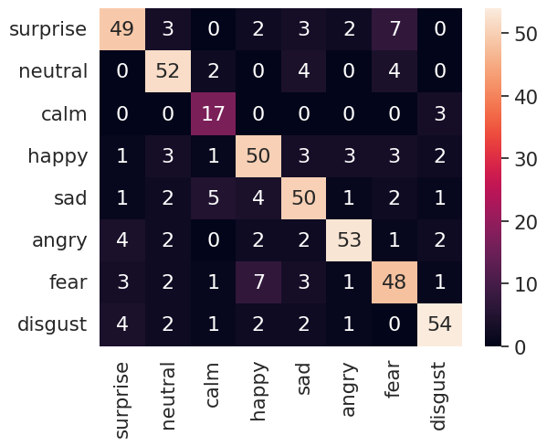

# # 7.12日报

## 情绪识别模型

1. 采用了更加庞大的数据集，语音条数一共是480+2800+4800+7421，情绪种类一共8种，情绪种类是：anger、disgust、fear、happiness、neutral、sadness、surprise、contempt。每条音频48kHz，16bit，单声道，2s。
2. 模型用的是transformer+LSTM，训练时间很快，一个epoch需要8s，准确率极高，train_acc达到99.5%，val_data占数据的1/10，acc达到80%以上。收敛速度很快，大概13个epoch左右就收敛，达到98%以上的 accuracy。
3. 模型为CTRL，拥有最多的参数。CTRL是一个由四个不同组件组成的并行网络：一个四层CNN(C)、四个多头自关注变压器编码器(T)、RESNET-18(R)和一个两层双向LSTM(L)。CTRL包含超过1000万个可训练参数，是目前所知的最复杂的SER网络之一。
4. 设计模型量化压缩方案：
   1. 在获取原始特征图和训练的深度学习模型之后，选择降维特征图的维度，将其设置为原始特征图的40%、30%、20%和10%。因此简化特征图的特定宽度和高度对，即分别为(104,108)、(90，93)、(74，75)和(52，53)。这些降维的特征图直观地表示为feature map。
   2. 实现了三种公认的传统降维方法，将原始特征图的维度降至相同的维度(104,108)，(90，93)，(74，75)和(52，53)。这三种方法包括主成分分析(PCA)、自动编码器(AE)和均匀流形逼近和投影(UMAP)。

## speech-enhancement

1. 基于AVfoundation做了一个ios软件，功能是收集录音、播放录音、同时coreml做语音处理。
2. coreml处理分为实时与离线两种，实时处理需要使用AVFoundation的AVAudioEngine，离线处理需要使用AVFoundation的AVAudioPCMBuffer。
3. 因为模型针对的格式还是WAV，所以需要将原始采集的PCM数据转为WAV格式，然后使用AVAudioPCMBuffer读取。

## 下一步工作

1. 针对情感分析做fine_tuning训练：虽然模型准确率很高，但是模型对情绪的识别不够准确，需要做fine_tuning训练。针对一些channel进行多参数选择。
2. 找一些实际歌声数据进行test，测试在2s、10s或者更长的模型效果（准确度与推理时间）。
3. 
