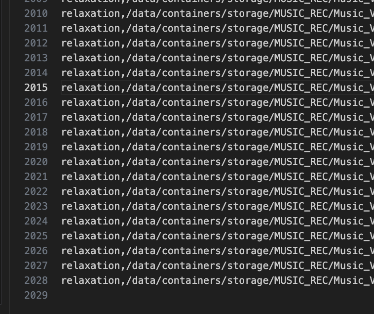

# 7.15日报

## 语音情感识别

1. 在网易云音乐网页端爬虫整理出2000首30s、44.1kHz、16bit下的音乐信号，准备放入模型中进行推理。
2. 为了增强提出的方法在不同数据集上的泛化能力，通过合并多个广泛使用的语音情感数据集创建了一个复合数据集：RAVDESS、SAVEE、TESS以及MUSIC_VIDEO。这些数据集显示音频长度和开始帧的变化。
3. 总的来说，组合数据集包含4720个音频片段，包含八种不同的情绪：平静，快乐，悲伤，愤怒，恐惧，惊讶，厌恶和中立。每个音频剪辑，以消除任何无声的片段。随后选择从新的起始帧开始的3.5秒片段作为输入，以确保均匀的段长度。数据集按照80：10：10的比例划分为训练集、验证集和测试集。
4. 同时对训练集进行了数据增强，通过向原始音频片段添加高斯噪声来生成两个额外的样本，以减轻过拟合。因此，增强训练集包含1131个音频片段，验证集包含1131个片段，测试集包含11311个片段。对于所有音频片段，计算Mel-频谱图作为原始特征图。
5. 梅尔语谱图包含部分韵律和音段信息的谱特征。这些光谱图的尺寸为148 × 188。
6. 整理validation数据集，运用自己的干声信号来检测对应的情绪
7. 写一个ios上的demo，尝试对自己的歌声进行实时情绪识别
